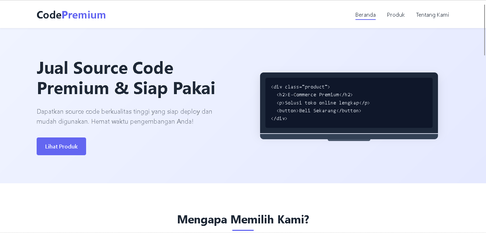

# CodePremium - Website Penjualan Source Code Premium

Website modern untuk penjualan source code premium dengan desain UI/UX yang bersih dan responsif. Platform ini didesain untuk memudahkan penjualan dan pembelian source code premium dengan tampilan yang profesional dan fitur yang lengkap.

> 🚀 **Dibuat oleh [codefomo.xyz](https://codefomo.xyz)** - Solusi Digital Terbaik untuk Bisnis Anda

## Struktur Proyek

```
SourceCodeMarketplace/
├── assets/
│   ├── css/
│   │   └── style.css
│   ├── js/
│   │   ├── script.js
│   │   ├── products.js
│   │   ├── product-detail.js
│   │   ├── checkout.js
│   │   └── home-products.js
│   └── images/
│       ├── product1.png
│       ├── product2.png
│       ├── product3.png
│       └── product4.png
├── index.html
├── products.html
├── product-detail.html
├── checkout.html
├── product-upload-template.json
└── README.md
```

## Fitur Utama

1. **Halaman Beranda (Home)**
   - Hero section dengan judul dan call-to-action
   - Animasi laptop dengan preview code
   - Fitur utama website
   - Produk populer

2. **Halaman Produk**
   - Daftar produk dalam bentuk grid
   - Filter berdasarkan kategori dan harga
   - Pencarian produk

3. **Halaman Detail Produk**
   - Gambar produk
   - Deskripsi lengkap
   - Fitur utama
   - Teknologi yang digunakan
   - Tombol checkout

4. **Halaman Checkout**
   - Form informasi pembeli
   - Sistem kode diskon (gunakan "YOSH" untuk diskon 20%)
   - Kalkulasi harga secara real-time
   - Integrasi dengan WhatsApp untuk menghubungi penjual

## Teknologi yang Digunakan

- HTML5
- CSS3 (dengan animasi dan transisi)
- JavaScript (vanilla, tanpa framework)
- Font Awesome untuk ikon
- Desain responsif untuk desktop dan mobile

## Cara Penggunaan

1. Buka file `index.html` di browser untuk melihat halaman utama
2. Navigasi ke halaman produk melalui menu atau tombol "Lihat Produk"
3. Klik pada produk untuk melihat detail
4. Klik "Checkout Sekarang" untuk melanjutkan ke halaman pembayaran
5. Isi form checkout dan gunakan kode diskon "YOSH" untuk mendapatkan diskon 20%
6. Klik tombol "Hubungi Owner via WhatsApp" untuk menyelesaikan pembelian

## Catatan Pengembangan

- Website ini menggunakan JavaScript vanilla tanpa framework untuk performa optimal
- Data produk dimuat dari file `product-upload-template.json` menggunakan fetch API
- Untuk menambah atau mengubah produk, cukup edit file `product-upload-template.json`
- Semua halaman (home, products, product-detail, checkout) menggunakan data dari file JSON yang sama
- Sistem pembayaran saat ini menggunakan WhatsApp sebagai media komunikasi dengan penjual

## Cara Menambahkan Produk Baru

1. Buka file `product-upload-template.json`
2. Tambahkan objek produk baru dengan format yang sama seperti produk yang sudah ada
3. Pastikan setiap produk memiliki ID unik
4. Simpan file dan refresh halaman website untuk melihat perubahan

## Format Data Produk

```json
{
  "id": 1,
  "name": "Nama Produk",
  "price": 1000000,
  "category": "ecommerce",
  "image": "assets/images/nama-gambar.png",
  "description": "Deskripsi lengkap produk",
  "features": [
    "Fitur 1",
    "Fitur 2",
    "Fitur 3"
  ],
  "technologies": [
    "Teknologi 1",
    "Teknologi 2",
    "Teknologi 3"
  ]
}
```
